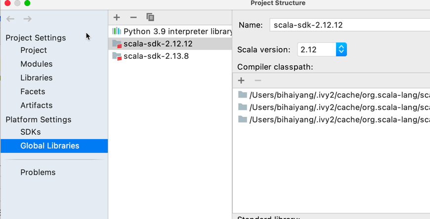

# datalake-example
datalake-example

## 运行环境

jdk 1.8+  
maven > 3.6  
idea 安装scala 插件  
Libraries: 


本地搭建alluxio: https://docs.alluxio.io/os/user/stable/cn/deploy/Running-Alluxio-Locally.html

## 模块

各模块pom 版本独立，以下模块文件系统均使用 alluxio,  
如无 alluxio 需求可以将 alluxio 相关路径修改为相应文件系统, 并删除
```
.config("fs.alluxio.impl", "alluxio.hadoop.FileSystem")
```
代码

### spark-iceberg-example
使用 spark 版本3.3.1、 alluxio 版本2.7.3、 iceberg 版本1.2.1，如有需要直接修改对应版本即可

### flink-iceberg-example
使用 flink 版本1.16.0、 alluxio 版本2.7.3、 iceberg 版本1.2.1，如有需要直接修改对应版本即可

### spark-hudi-example
使用 spark 版本3.3.1、 alluxio 版本2.7.3、 hudi 版本0.13.0，如有需要直接修改对应版本即可

### flink-hudi-example
使用 flink 版本1.16.0、 alluxio 版本2.7.3、 hudi 版本0.13.0，如有需要直接修改对应版本即可

