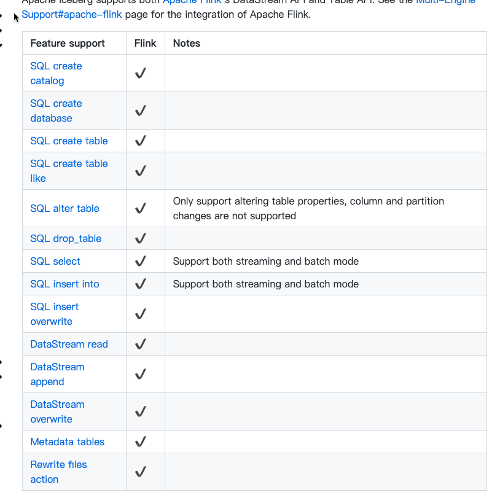
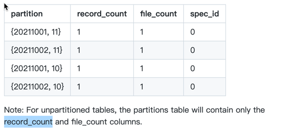

## Iceberg Flink 

-> Apache Iceberg supports both Apache Flink’s DataStream API and Table API. See the Multi-Engine Support#apache-flink page for the integration of Apache Flink.




## Iceberg flink Catalog 创建
[iceberg 官网链接](https://iceberg.apache.org/docs/latest/flink-ddl/#create-catalog)  
目前flink Iceberg 支持 **Hive catalog**、 **Hadoop catalog**、**REST catalog**、**Custom catalog**     

##### Hive catalog

```sql
CREATE CATALOG hive_catalog WITH (
  'type'='iceberg',
  'catalog-type'='hive',
  'uri'='thrift://localhost:9083',
  'clients'='5',
  'property-version'='1',
  'warehouse'='hdfs://nn:8020/warehouse/path'
);
```

使用 hive catalog 可以使用hive metastore管理hive表，hive catalog properties如下
- uri: The Hive metastore’s thrift URI. (Required)
- clients: The Hive metastore client pool size, default value is 2. (Optional)
- warehouse: The Hive warehouse location, users should specify this path if neither set the hive-conf-dir to specify a location containing a hive-site.xml configuration file nor add a correct hive-site.xml to classpath.
- hive-conf-dir: Path to a directory containing a hive-site.xml configuration file which will be used to provide custom Hive configuration values. The value of hive.metastore.warehouse.dir from <hive-conf-dir>/hive-site.xml (or hive configure file from classpath) will be overwritten with the warehouse value if setting both hive-conf-dir and warehouse when creating iceberg catalog.
- hadoop-conf-dir: Path to a directory containing core-site.xml and hdfs-site.xml configuration files which will be used to provide custom Hadoop configuration values.


##### Hadoop catalog

```sql
CREATE CATALOG hadoop_catalog WITH (
  'type'='iceberg',
  'catalog-type'='hadoop',
  'warehouse'='hdfs://nn:8020/warehouse/path',
  'property-version'='1'
);
```
使用 hadoop catalog 可以管理基于文件管理系统的表，一般alluxio、hdfs、s3都会选择此catalog，同时此catalog properties只有一个必填项

- warehouse: The HDFS directory to store metadata files and data files. (Required)

##### REST catalog

```sql
CREATE CATALOG rest_catalog WITH (
  'type'='iceberg',
  'catalog-type'='rest',
  'uri'='https://localhost/'
);
```
这个catalog 使用来接受rest api的数据，这个api也只有3个 properties，目前支持

- uri: The URL to the REST Catalog (Required)
- credential: A credential to exchange for a token in the OAuth2 client credentials flow (Optional)
- token: A token which will be used to interact with the server (Optional)


##### Custom catalog

```sql
CREATE CATALOG my_catalog WITH (
  'type'='iceberg',
  'catalog-impl'='com.my.custom.CatalogImpl',
  'my-additional-catalog-config'='my-value'
);
```
用户也可以自定义catalog 


### Inspect table 
[iceberg inspect 官网链接](https://iceberg.apache.org/docs/latest/flink-queries/#inspecting-tables)
##### History

查询iceberg 模型历史记录,这个历史会显示已经回滚的提交，
```sql
SELECT * FROM prod.db.`table$history`;
```

##### metadata_log_entry

显示表元数据日志条目
```sql
SELECT * from prod.db.`table$metadata_log_entries`;
```

##### Snapshots
快照，显示当前表的有效快照，
```sql
SELECT * FROM prod.db.`table$snapshots`;
```    
    
##### manifests

查询表当前文件清单
```sql
SELECT * FROM prod.db.table$manifests;
```
查询当前表所有文件清单
```sql
SELECT * FROM prod.db.table$all_manifests;
```
###### partition
查询表分区，在查询非分区表的时候，只会展示file_count和 record_count 两个字段
```sql
SELECT * FROM prod.db.table$partitions;
```
    


#### All Metadata Tables

##### All Data Files
查询所有的文件根据快照，显示的时候每个快照对应的文件， 所以可以会存在一个文件有多行对应多个快照id

```sql
SELECT * FROM prod.db.table$all_data_files;
```

###### ref
查看表已知的快照引用
```sql
SELECT * FROM prod.db.table$refs;
```


