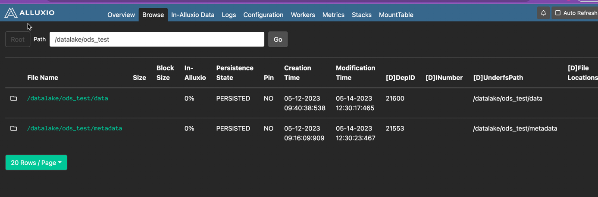
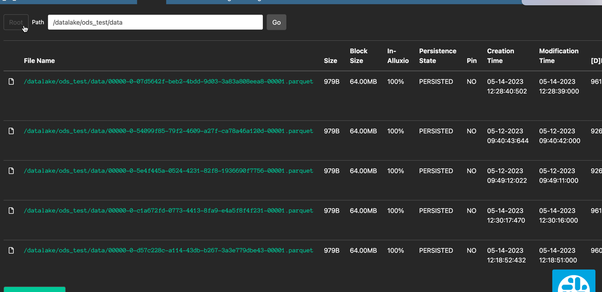
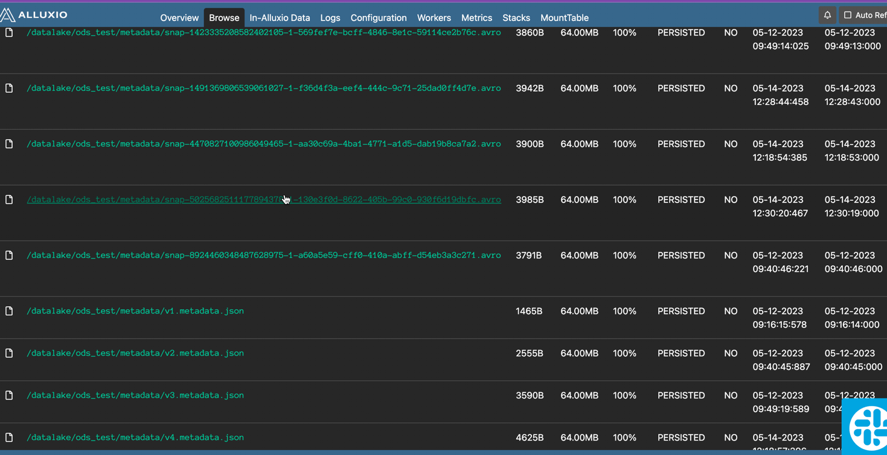

## Iceberg 模型创建

#### 1、getting start
iceberg on spark sql模型创建方式与 spark 传统建表方式类似, 指定数据格式为 iceberg 即可，
iceberg 数据相关信息有iceberg本身存储
```sql
CREATE TABLE IF NOT EXISTS hadoop.datalake.ods_test (
    id bigint,
    data string,
    category string)
USING iceberg
```
模型创建成功就可以在 warehouse 中查看到相关表数据


iceberg 本身数据分为两个部分
- /data 存储表真实数据，当然被删除的数据也会被存储到这里

- /metadata iceberg 表版本、schema等信息


Iceberg 会将 Spark 中的列类型转换为对应的 Iceberg 类型。有关详细信息，请查看有关创建表的类型兼容性部分。

表创建命令，包括 CTAS 和 RTAS，支持全系列的 Spark 创建子句，包括：

- PARTITIONED BY (partition-expressions) 配置分区
- LOCATION '(fully-qualified-uri)'设置表位置
- COMMENT 'table documentation'设置表描述
- TBLPROPERTIES ('key'='value', ...)设置表配置

创建命令还可以使用子句设置默认格式USING。这仅受支持，SparkCatalog因为 Spark USING 对内置目录的子句处理方式不同。
  
#### 2、PARTITIONED BY

```sql
    -- 创建分区表
    CREATE TABLE prod.db.sample (
        id bigint,
        data string,
        category string)
        USING iceberg
    PARTITIONED BY (category)
```

partitioned by 还支持 **隐藏分区**，类似mysql，目前支持表达式如下

支持的转换是：

- years(ts): 按年份划分
- months(ts): 按月划分
- days(ts)or date(ts): 相当于 dateint 分区
- hours(ts)or date_hour(ts): 相当于 dateint 和 hour 分区
- bucket(N, col): 按散列值 mod N 桶分区
- truncate(L, col): 按截断为 L 的值进行分区 
  - 字符串被截断为给定长度
  - 整数和长整数截断到 bins：truncate(10, i)产生分区 0、10、20、30，... 
  

```scala
CREATE TABLE prod.db.sample (
    id bigint,
    data string,
    category string,
    ts timestamp)
USING iceberg
PARTITIONED BY (bucket(16, id), days(ts), category)
```


#### 3、CREATE TABLE ... AS SELECT


  

